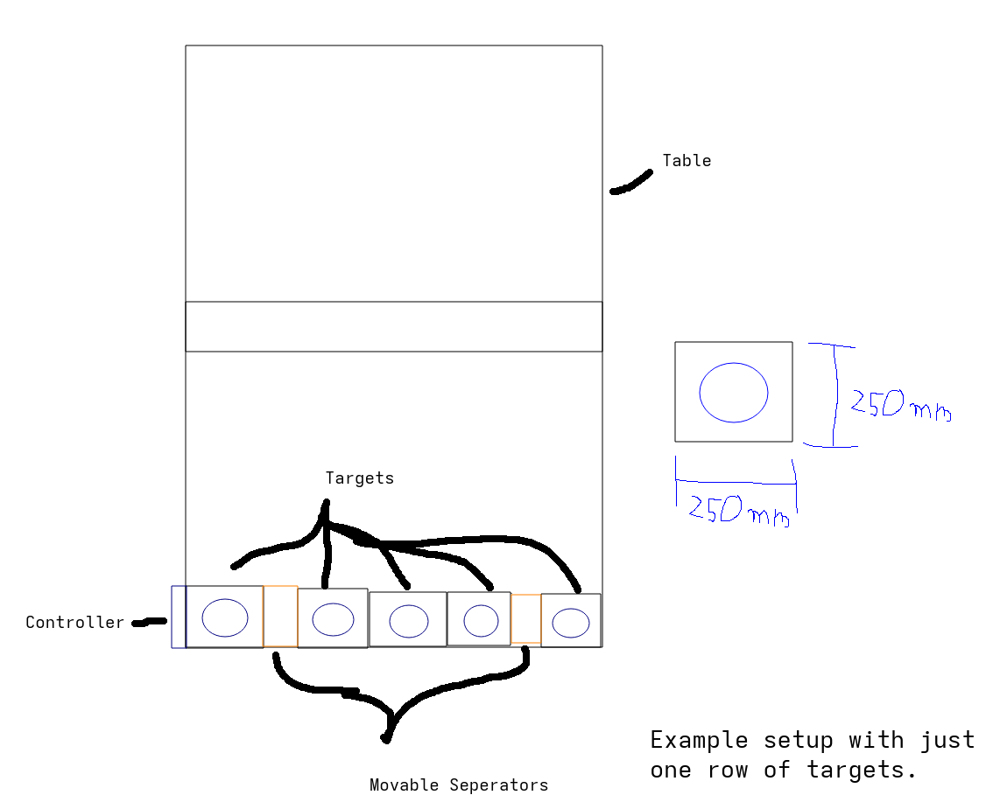

# PongTarget

A precision trainer for table tennis.

It consists of 2 rows, each containing 5 targets. The targets light up when they need to be hit, and the score increases upon hitting them.

# Hardware and Idea
## Base idea
2 seperate rows with each a controller which then communicate via ESP-NOW.
Each row has 5 targets. Targets and controller communicate via I2C.

## Controller
TBD: Esp32c3, oled, rotary, usb c pd

## Target
The targets are connected via magnetic 6 pin pogo connectors. (+5V, GND, SDA, SCL, GND, +5V)

They detect the balls vibrations via 20mm piezo sensors.

They use an attiny3216.

They have 16 [SK6812](https://www.lcsc.com/product-detail/C5380881.html?s_z=n_SK6812) addressable LEDs in a ring. This means around 800mA per target, which is 4A for 5 targets. This is in range of our 6A maximum with 3A per +5V pin.