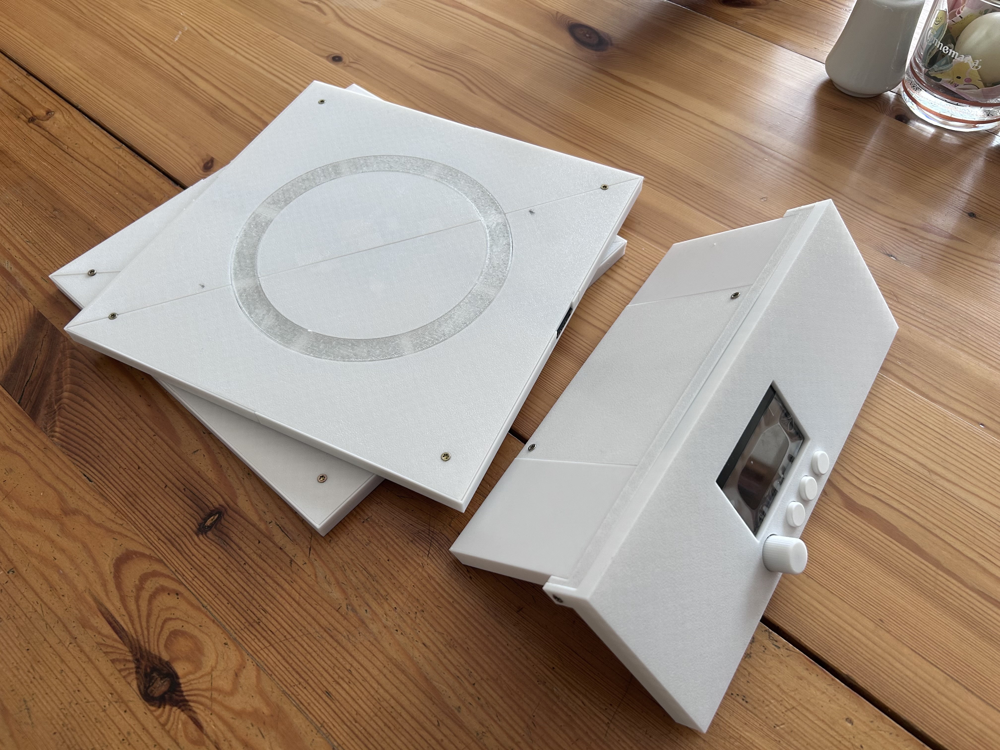
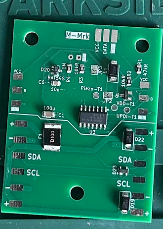
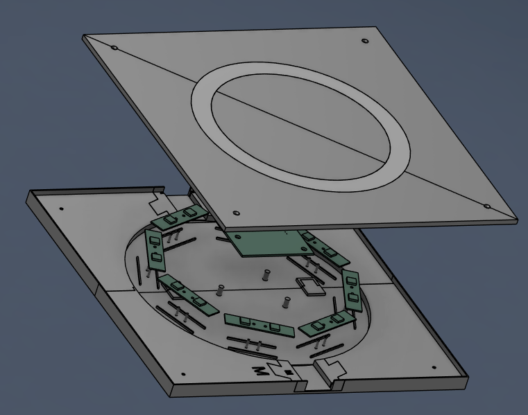
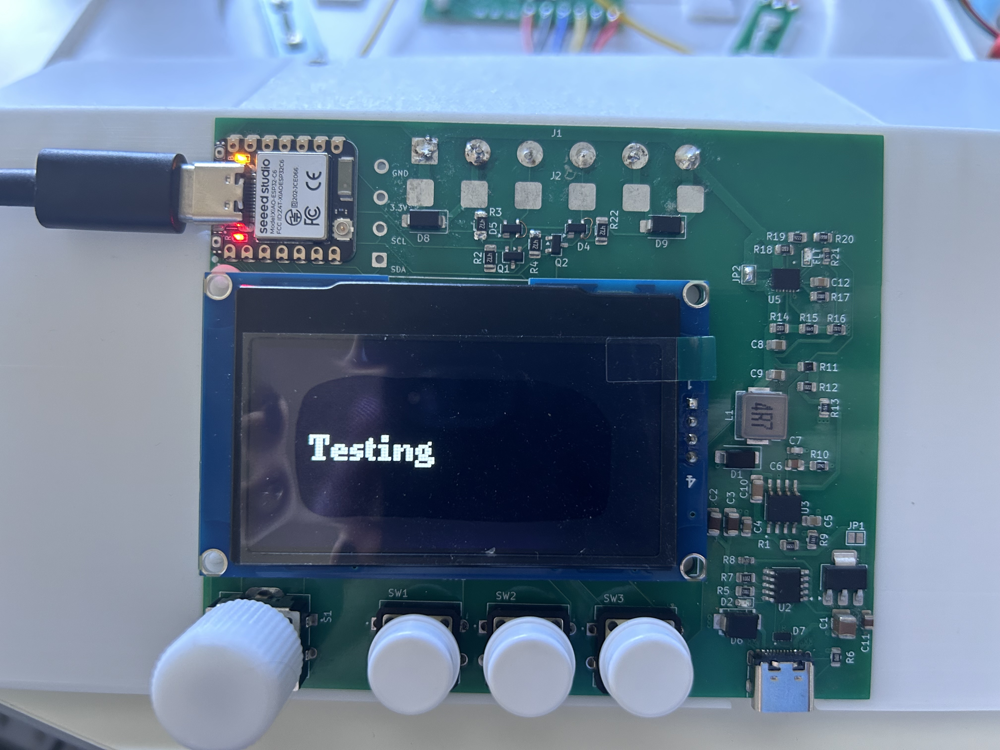
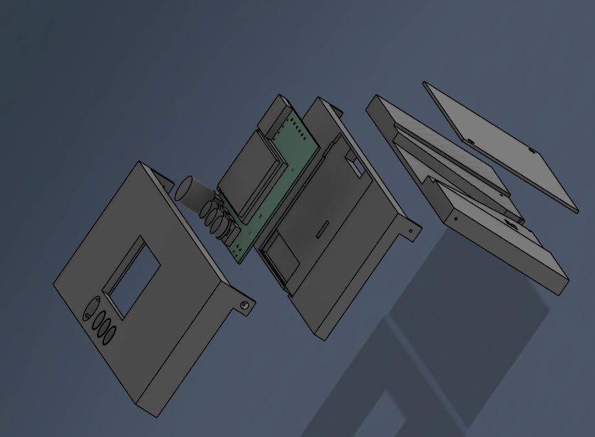

# BlitzPong

A precision trainer for table tennis that helps develop accuracy and ball placement control.

The device features 2 rows of 5 targets each. Targets illuminate to indicate where to hit, and your score increases with each successful hit.

**Note:** Current version supports individual row training without cross-row communication.
**Note:** Current hardware is wrong due to lcsc/Xinglight component change. Do not try to build before this is addressed

## Use Case
Many table tennis players only focus on spin and speed, but neglect conscious placement to specific table zones. BlitzPong trains exactly that - precision targeting and shot placement.
Just place all the targets on the table, put the controller on the side, go through the setup and start the game.

## Why I made this
I noticed exactly what is mentioned above and was participating in [Hackclub's Blueprint](https://blueprint.hackclub.com) so I took the opportunity to build something for training precision or at least conscious.

# Pictures and Assembly
## Target
### PCB

- Place all components and solder
- Solder on piezo disc. Make sure to connect the bigger disc to the rounded pad
- Put isolating tape on the piezo disc on the side with the small disc
- Connect UPDI Serial tool and open [this](Software/target/platformio.ini) in PlatformIO and upload

### Case

- Print everything in PETG and the diffuser ring preferably in transparent PETG
- Push both bottom parts together
- Place all 8 LED pcbs and the target pcb
- Connect the LED pcbs with wires like [shown here](pictures/target-led-diagram.png)
- Solder wires to one female pogo connector and one male connector. (Watch out for the magnets!)
- Put pogo connectors into the cutouts and solder wires to target pcb ([diagram](pictures/target-pogo-diagram.png)). (Orient red mark of connector to where the M/F indent is and put female pogo connector in F cutout and vice versa)
- Slide both top parts together and press fit the diffuser
- Glue the piezo disc in the center of the bottom of the top parts
- Press top cover on and screw all 4 2.5x10mm screws in

## Controller
### PCB

**Note:** You may skip the eFuse and its passives. The picture also jumped (JP2) the eFuse, as it can be very hard to solder
- Place all SMD components and solder
- Print display adapter and place
- Place Display, Switches and Encoder and solder. Note that the encoder tabs might be very hard to solder as they are only designed to be wave soldered.
- Put on encoder cap and button caps

### Case

- Print everything
- Solder wires to male pogo connector and place connector in back piece (Put red marked side to where the M indent is)
- Place PCB in center part
- Feed wires through the back of pcb, trim and solder
- Screw on lid to back piece (2.5x10mm Screws)
- Connect MCU to computer, open [this](Software/controller/platformio.ini) in platformIO and upload 
- Press front cover on and screw all 3 pieces together with 2 screws on the side

# BOM
**Note:** The pogo connectors are from RTLECS with 6 Pins, Ears and straight pins
## Controller
|Reference   |Qty|Value                  |Datasheet                                                                                                                   |LCSC     |Link       |
|------------|---|-----------------------|----------------------------------------------------------------------------------------------------------------------------|---------|-----------|
|C1          |1  |22u                    |~                                                                                                                           |C309062  |           |
|C10         |1  |100n                   |~                                                                                                                           |C93194   |           |
|C11         |1  |10u                    |~                                                                                                                           |C3039694 |           |
|C12         |1  |22n                    |~                                                                                                                           |C1729    |           |
|C2,C3       |2  |4.7u                   |~                                                                                                                           |C51205   |           |
|C4,C5       |2  |10n                    |~                                                                                                                           |C83170   |           |
|C6          |1  |2.2n                   |~                                                                                                                           |C36576   |           |
|C7          |1  |22p                    |~                                                                                                                           |C2169931 |           |
|C8,C9       |2  |47u                    |~                                                                                                                           |C16780   |           |
|D1          |1  |SS54                   |~                                                                                                                           |C20609300|           |
|D2          |1  |LED                    |~                                                                                                                           |C51933292|           |
|D3          |1  |PWR_FLT                |~                                                                                                                           |C51933292|           |
|D4,D5       |2  |PRTR5V0U2X             |https://assets.nexperia.com/documents/data-sheet/PRTR5V0U2X.pdf                                                             |C5180302 |           |
|D6          |1  |~                      |https://item.szlcsc.com/datasheet/SMBJ24CA/975605.html                                                                      |C908853  |           |
|D7          |1  |~                      |https://www.ti.com/cn/lit/gpn/tpd4e05u06                                                                                    |C138714  |           |
|D8,D9       |2  |SMAJ6.0CA              |https://www.littelfuse.com/media?resourcetype=datasheets&itemid=75e32973-b177-4ee3-a0ff-cedaf1abdb93&filename=smaj-datasheet|C908810  |           |
|J2          |1  |Pogo_01x06_male        |~                                                                                                                           |         |https://aliexpress.com/item/1005005284441979.html|
|J3          |1  |G-Switch GT-USB-7010ASV|https://www.usb.org/sites/default/files/documents/usb_type-c.zip                                                            |C2988369 |           |
|J5          |1  |0.91 OLED              |~                                                                                                                           |C5248081 ||
|L1          |1  |4.7u                   |https://www.lcsc.com/datasheet/C5307631.pdf                                                                                 |C5307631 ||
|LCD1        |1  |2.42 OLED              |https://atta.szlcsc.com/upload/public/pdf/source/20230720/72FFD800C7ED95A3980F98F3DF4670E2.pdf                              |C7466001 ||
|Q1,Q2       |2  |BSS138                 |https://www.onsemi.com/pub/Collateral/BSS138-D.PDF                                                                          |C40912   ||
|R1          |1  |665k                   |~                                                                                                                           |C48533721||
|R10         |1  |37.4k                  |~                                                                                                                           |C2999586 ||
|R11         |1  |51.1                   |~                                                                                                                           |C2077153 ||
|R12         |1  |10.2k                  |~                                                                                                                           |C2933282 ||
|R13         |1  |1.96k                  |~                                                                                                                           |C2930163 ||
|R14,R18     |2  |120k                   |~                                                                                                                           |C17436   ||
|R15         |1  |6.49k                  |~                                                                                                                           |C2933484 ||
|R16         |1  |26.7k                  |~                                                                                                                           |C2999467 ||
|R17         |1  |20k                    |~                                                                                                                           |C2907240 ||
|R19         |1  |42.2k                  |~                                                                                                                           |C5119971 ||
|R2,R3,R4,R22|4  |4.7K                   |~                                                                                                                           |C2907499 ||
|R20         |1  |8.66k                  |~                                                                                                                           |C2933506 ||
|R21         |1  |150                    |~                                                                                                                           |C2907103 ||
|R5          |1  |24K                    |~                                                                                                                           |C2907246 ||
|R6          |1  |10                     |~                                                                                                                           |C17415   ||
|R7          |1  |10K                    |~                                                                                                                           |C84376   ||
|R8          |1  |68                     |~                                                                                                                           |C27592   ||
|R9          |1  |130k                   |~                                                                                                                           |C2933305 ||
|S1          |1  |PEC12R-4120F-S0012     |https://www.lcsc.com/datasheet/C143801.pdf                                                                                  |C143801  ||
|SW1,SW2,SW3 |3  |B3F-4055               |~                                                                                                                           |C36498965||
|U1          |1  |XIAO-ESP32-C6-SMD      |                                                                                                                            |         |https://aliexpress.com/item/1005010618607905.html|
|U2          |1  |CH224K                 |https://www.wch.cn/downloads/file/301.html                                                                                  |C970725  ||
|U3          |1  |TPS54531DDAR           |https://www.lcsc.com/datasheet/C50605.pdf                                                                                   |C50605   ||
|U4          |1  |AMS1117-3.3            |http://www.advanced-monolithic.com/pdf/ds1117.pdf                                                                           |C347222  ||
|U5          |1  |TPS25942ARVCR          |                                                                                                                            |C181295  ||

## Target (with LEDs)
|Reference   |Qty|Value                  |Datasheet                                                                                                                   |LCSC     |Link       |
|------------|---|-----------------------|----------------------------------------------------------------------------------------------------------------------------|---------|-----------|
|C1          |1  |100u                   |~                                                                                                                           |C15008   |           |
|C2,C3,C4,C5 |4  |100nC                  |~                                                                                                                           |C93194   |           |
|C6          |1  |10n                    |~                                                                                                                           |C83170   |           |
|D1          |1  |SS54                   |~                                                                                                                           |C20609300|           |
|D2,D3,D4,D5,D6,D7,D8,D9,D10,D11,D12,D13,D14,D15,D16,D17|16 |XL-5050RGBC-SK6812B    |https://cdn-shop.adafruit.com/product-files/1138/SK6812+LED+datasheet+.pdf       |C5349959 |           |
|D18,D21     |2  |PRTR5V0U2X             |https://assets.nexperia.com/documents/data-sheet/PRTR5V0U2X.pdf                                                             |C5180302 |           |
|D19,D22     |2  |SMAJ6.0CA              |https://www.littelfuse.com/media?resourcetype=datasheets&itemid=75e32973-b177-4ee3-a0ff-cedaf1abdb93&filename=smaj-datasheet|C908810  |           |
|D20         |1  |BAT54S                 |https://www.diodes.com/assets/Datasheets/ds11005.pdf                                                                        |C19726   |           |
|F1          |1  |Polyfuse IT2A          |~                                                                                                                           |C22366130|           |
|J1          |1  |Pogo_01x06_female      |~                                                                                                                           |         |https://aliexpress.com/item/1005005284441979.html|
|J2          |1  |Pogo_01x06_male        |~                                                                                                                           |         |https://aliexpress.com/item/1005005284441979.html|
|J5          |1  |Piezo                  |~                                                                                                                           |         |https://aliexpress.com/item/1005003133740770.html|
|Q1          |1  |SI2333CDS-HXY          |                                                                                                                            |C18198389|           |
|R1          |1  |47kR                   |~                                                                                                                           |C2907330 |           |
|R2,R3       |2  |10kR                   |~                                                                                                                           |C84376   |           |
|R4          |1  |1M                     |~                                                                                                                           |C17514   |           |
|U1          |1  |Attiny1614-SSF         |https://www.lcsc.com/datasheet/C614831.pdf                                                                                  |C614831  |           |
